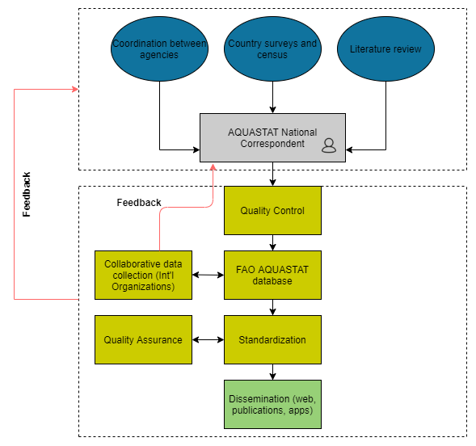
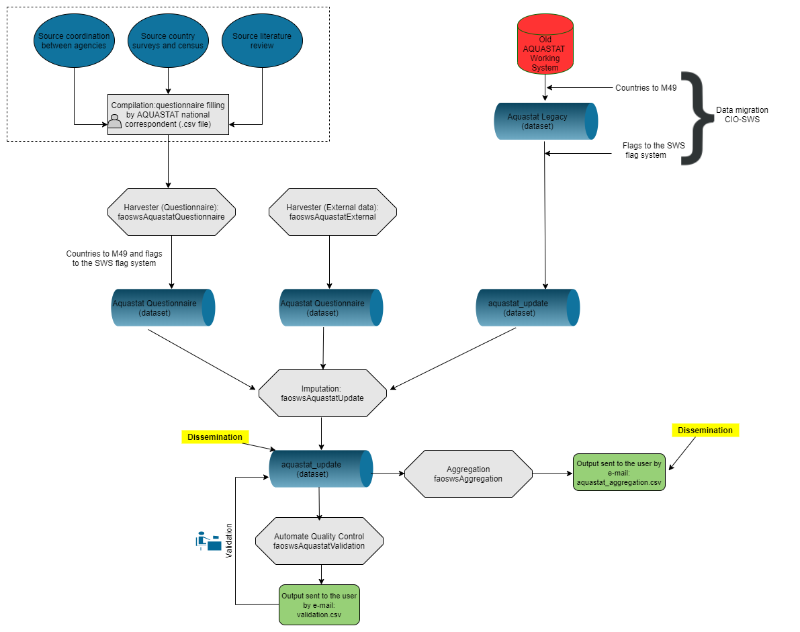

# **AQUASTAT Framework** {#AquastatFramework}

The book focuses on the migration of the AQUASTAT statistical processes to SWS. However, for those interested, AQUASTAT has a dedicated FAO website where the [new methodology](http://www.fao.org/aquastat/overview/methodology) for data collection and data management can be accessed. The next sections summarize the AQUASTAT data collection and information management methodology.


## **Data Collection**

1. Data collection relies on a network of AQUASTAT national correspondents in charge of the provision of official national data;

2. As of January of 2019, 107 countries have nominated AQUASTAT national correspondents as requested by FAO Land and Water Division   between April-May 2018;

3. Alternate correspondents from different agencies are also used to improve the data collection;

4. The **FAO Office of the Chief Statistician (OCS)** has endorsed the annual **Water and Agriculture** questionnaire;

5. AQUASTAT sends out the questionnaire in the first semester of each year.


## **Questionnaire**

The **Water and Agriculture** questionnaire has the following characteristics:
  
  1. Three introductory sections: Cover page, Instructions, Definitions;

2. One data reporting section, including national data on water withdrawal, dam capacity, municipal wastewater, irrigation and drainage;

3. Two Supplementary Information sections: Metadata, Feedback.

4. In addition, to the annual data collection, a more complete questionnaire will be sent every 5 years to populate other AQUASTAT [databases](http://www.fao.org/aquastat/databases/).

5. To download the **Water and Agriculture** questionnaire, please click on this [link](https://firebasestorage.googleapis.com/v0/b/fao-aquastat.appspot.com/o/Excel%2FAQUASTATQuestionnaire2018ENG.xlsm?alt=media&token=43a81b96-1853-46c9-bf38-e94de717efef).

## **The current AQUASTAT information management**

```{r fig1,  echo=FALSE, out.width="55%", fig.align="center",fig.cap='Aquastat Information Management'}

```

## **AQUASTAT in SWS: proposed dataflow**

AQUASTAT dataflow will predominantly be triggered by the filling and compilation of the **Water and Agriculture questionnaire** by the AQUASTAT network of National Correspondents. The CIO - SWS counterpart is responsible for creating a tailored questionnaire harvesters to automatically extract data from filled surveys and output it as an SWS compliant dataset. Once in the SWS, the technical unit will benefit from the tools and other features that have been developed to make the AQUASTAT dataflow as seamless as possible. On this basis, the flowchart below gives the AQUASTAT dataflow that has been fostered by the ESS - SWS team.

```{r figSWSDataFlow,  echo=FALSE, out.width="55%", fig.align="center",fig.cap='Developed AQUATAST - SWS dataflow'}

```


<!--```{r fig2, echo=FALSE, fig.cap='Developed AQUATAST - SWS dataflow', message=FALSE, warning=FALSE}

require(DiagrammeR)
DiagrammeR::grViz("digraph {

graph [layout = dot, rankdir = TB]

# define the global styles of the nodes. We can override these in box if we wish
node [shape = rectangle, style = filled, fillcolor = Linen]

# Inputs
coordination [label = 'Source \n coordination \n between agencies', shape = folder, fillcolor = Beige]
Surveys [label = 'Source \n Country surveys \n and census', shape = folder, fillcolor = Beige]
Literature [label = 'Source \n Literature review', shape = folder, fillcolor = Beige]

focalpoint [label = 'Compilation: \n questionnaire filling \n by AQUASTAT \n national correspondent', shape = folder, fillcolor = Beige]

SWSQH [label = 'Harvester: \n questionnaire harvesting \n by CIO - SWS', fillcolor = LightBlue]

Newdata [label = 'Dataset: \n data harvested from questionnaire \n and SWS compliant', shape = folder, fillcolor = Beige]

QA1 [label = 'QAQC \n Manual Quality control \n of data harvested from questionnaire', fillcolor = PaleGreen]

Newdata_val [label = 'Dataset: \n aquastat_questionnaire', shape = folder, fillcolor = Beige]

APIsourcing [label = 'Process: \n faoswsAquastatExternal module', fillcolor = PaleGreen]

APIdata [label = 'Dataset: \n aquastat_external', shape = folder, fillcolor = Beige]

oldsystem [label = 'Database: \n Old Aquastat Working System', shape = folder, fillcolor = Beige]

Migration [label = 'Migration: \n legacy data into the SWS \n done by CIO - SWS', fillcolor = LightBlue]

legacydata [label = 'Dataset: \n aquastat_legacy dataset ', shape = folder, fillcolor = Beige]

update [label = 'Process:: \n SWS faoswsAquastatUpdate module: \n 1. merges the questionnaire data, external data, and aquastat_legacy_corr \n 2. flag conversion, \n 3. apply calculations, 4. impute data, 5.  apply recalculations', shape = losangle, fillcolor = PaleGreen]

updateddata [label = 'Dataset: \n aquastat_update \n from SWS faoswsAquastatUpdate module ', shape = folder, fillcolor = Beige]

agg_proc [label = 'Process: \n faoswsAquastatAggregation module \n (Get regional SDG aggregations)', fillcolor = PaleGreen]
agg_out [label = 'Dataset: \n aquastat_aggregation \n sent to the user by email (.csv file)', shape = folder, fillcolor = Beige]

QA2 [label = 'Process: \n Automate Quality control \n by faoswsAquatsatValidation module', fillcolor = PaleGreen]

validationemail [label = 'Dataset: \n Validation output \n sent to the user by email (.csv file)', shape = folder, fillcolor = Beige]

QA3 [label = 'Process: \n Manual Quality control \n of faoswsAquatsatValidation module output', fillcolor = PaleGreen]

validated [label = 'Dataset: \n aquastat_update \n cleared by technical division', shape = folder, fillcolor = Beige]

AQUASWSdb [label = 'Dataset: \n aquastat_update \n saved in the SWS database', shape = folder, fillcolor = Beige]

Diss [label = 'Dissemination: \n  Web, publications, Apps', shape = folder, fillcolor = LightGrey]


# Flow
# edge definitions with the node IDs
{coordination, Surveys, Literature} -> focalpoint -> SWSQH -> Newdata -> QA1 -> Newdata_val -> update
{oldsystem} -> Migration -> legacydata -> update 
{APIsourcing} -> APIdata -> update -> updateddata -> QA2 -> validationemail -> QA3 -> validated -> AQUASWSdb -> Diss
{validated} -> agg_proc -> agg_out -> Diss
}")

```-->
<br>

## **AQUASTAT Elements**

The next chapters will treat the modules as well as their datasets and datatables in more details. However, after describing the current SWS resources involved in the AQUASTAT - SWS migration framework, it is important to have a look at how the technical units references its data and the list of the data collected, processed, and disseminated.

### **International Classification Systems**

AQUASTAT datasets use the following international classification systems to reference its elements:
  
  -  The International Standard Industrial Classification of All Economic Activities: [ISIC4](https://unstats.un.org/unsd/publication/seriesm/seriesm_4rev4e.pdf);

-  The System of Environmental-Economic Accounting for Water: [SEEA-Water](https://unstats.un.org/unsd/envaccounting/seeaw/) for water resources and withdrawals;

-  The World Census of Agriculture 2020: [WCA](http://www.fao.org/world-census-agriculture) (Volume 1), for irrigation definitions.

### **Current AQUASTAT Variables**

Variables are AQUASTAT elements that are non-calculated. These can be from different sources as described in the table below.

```{r aquaElements, echo=FALSE, message=FALSE}
library(data.table)
library(kableExtra)
d = data.table::fread("tables/aquastat_meta_FL_sources.csv")
d <- d[calculated %in% 'V']
d <- d[, c('Source', 'calculated', 'lta', 'PR') := NULL]

knitr::kable(d,   
             caption = paste("AQUASTAT variable codes and names actually collected."),
             booktabs = TRUE) %>%
  kableExtra::kable_styling(font_size = 12)
```


### **Current AQUASTAT indicators**

The indicators in AQUASTAT are calculated variables. 
```{r tab2, echo=FALSE, message=FALSE}
library(data.table)
library(kableExtra)
d = data.table::fread("tables/aquastat_meta_FL_sources.csv")
d <- d[calculated %in% 'C',.(element_code, element_name, disseminated, calculated, source)]
knitr::kable(d,   
             caption = paste("AQUASTAT indicators"),
             booktabs = TRUE) %>%
  kableExtra::kable_styling(font_size = 12)


```

### **Current External data**

The AQUASTAT calculated variables **Rural Population** and **Cultivated area (arable land + permanent crops)** are actually not calculated variables as they can be extracted from FAOSTAT. To solve it, the **faoswsAquastatExternal** module extracts these and other external data used by AQUASTAT and save them in the SWS-complaint **aquastat_external** dataset. This dataset is then used as one of the inputs of the **faoswsAquastatUpdate** module.

```{r externalData, echo=FALSE, message=FALSE}
require(data.table)
d = data.table::fread("tables/aquastat_meta_FL_sources.csv")
d <- d[Source == 'O']
d <- d[,.(element_code, element_name, disseminated, source)]
knitr::kable(d,   
             caption = paste("AQUASTAT indicators (derived) calculated by AQUASTAT."),
             booktabs = TRUE) %>%
  kableExtra::kable_styling(font_size = 12)

```


```{block , type='rmdnote'}
**IMPORTANT:**
  FAOSTAT data used by AQUASTAT is an in-house source, but in the **faoswsAquastatExternal** module it is being treated as an external source to facilitate the workflow.
```


