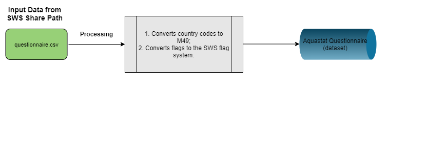

# **The faoswsAquastatQuestionnaire module** {#AquastatQuestionnaire}

The **faoswsAquastatQuestionnaire** is essentially a data harvester. It converts countries to m49 and flags to the SWS flag system.


```{r  aquastatQuest, echo=FALSE, out.width="75%", fig.align="center", fig.show='hold', fig.cap='Workflow of the faoswsAquastatQuestionnaire module'}


```


## **Steps**

The module is straightforward and executes only two process.

- Country code to M49;
- Flags to SWS flag system.

## **Running the module**

1. Log in the SWS;

2. Click on **New Query**;

3. Select **AQUASTAT domain** and **Aquastat Questionnaire dataset**;

4. Select whatever geographicM49Area, aquastatElement, and timePointYears;
<br>
```{r queryAquastatQuest,  echo=FALSE, out.width="100%", fig.cap='Steps 1 to 4'}
knitr::include_graphics("images/faoswsAquastatQuestionnaire_query.png")
```
<br>
5. Run the query and you may get an empty session (if there are no data for what you have selected);
<br>
```{r queryAquastatQuestEmpty,  echo=FALSE, out.width="100%", fig.cap='Steps 1 to 4'}
knitr::include_graphics("images/faoswsAquastatQuest_empty.png")
```
<br>

6. Click on **Run plugin** on the top-right;

7. Select the **faoswsAquastatQuestionnaire** module and click on **Run plugin**;

<br>
```{r questPlugin,  echo=FALSE, out.width="100%", fig.cap='Select the AquastatQuestionnaire plugin and run it'}
knitr::include_graphics("images/aqua_quest_plugin.png")
```
<br>
8. Wait for the results to appear in the session;
```{r aquaResults,  echo=FALSE, out.width="100%", fig.cap='Select the Aquastat Questionnaire plugin output in the session'}
knitr::include_graphics("images/aqua_quest_run.png")
```
<br>

9. Click on **Save to dataset**;

