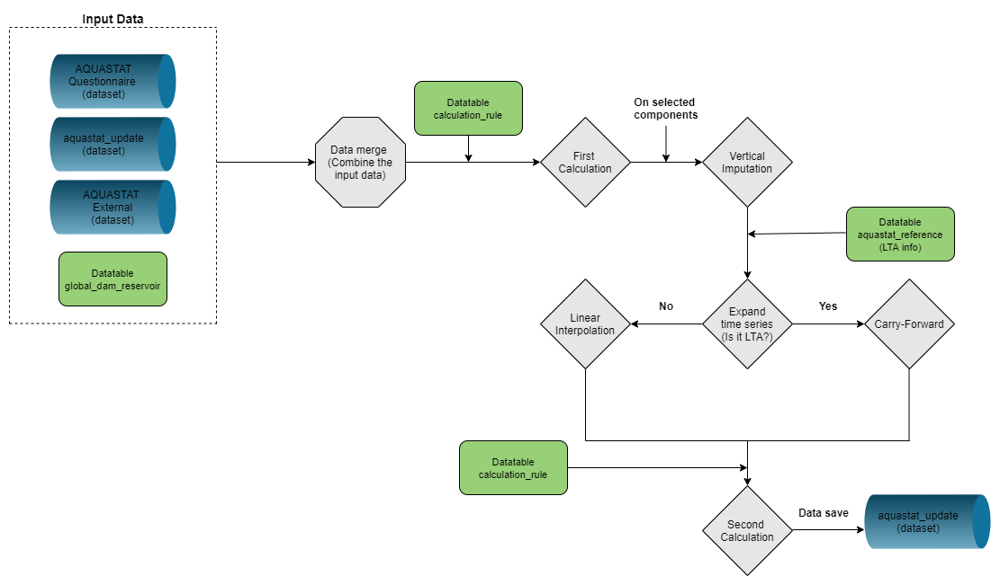
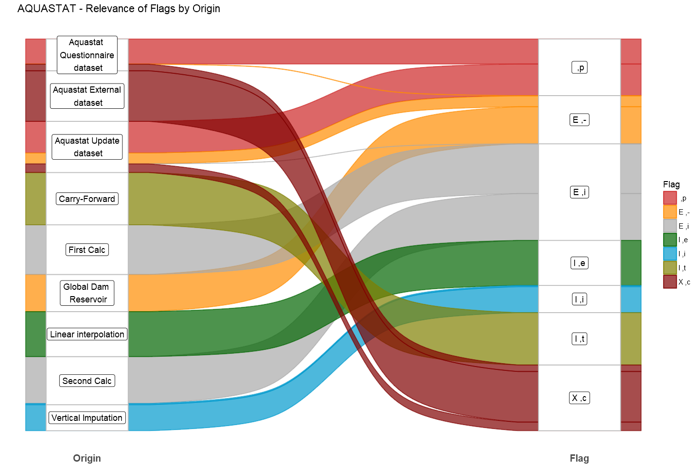

# **The faoswsAquastaUpdate module** {#faoswsAquastatUpdate}

The **faoswsAquastatUpdate** module is the *heart* of the AQUASTAT migration into the SWS since it runs the periodic update of the `aquastat_update` dataset whenever new data from questionnaire and/or external sources are available.


```{r  figWORKFLOWUPDATE, echo=FALSE, out.width="75%", fig.align="center", fig.cap='Workflow of the faoswsAquastatUpdate module'}


```

## **Methods**

The **faoswsAquastatUpdate** module applies different imputation's methods, depending on the `aquastatElement`. Below you find their definitions and applications in the module.  

### **Calculate indicators (*First Calculation*)**

After merging the data coming from the `AQUASTAT Questionnaire`, `AQUASTAT External` and `aquastat_update`, the **faoswsAquastatupdate** module implements the calculation of indicators by applying the information in the SWS `calculation_rule` datatable.

<!--The **First Calculation** and **Second Calculations** are the key part of the module as they apply the available formulas in the datatable `calculation_rule`.
The calculations are restricted applied just to the `aquastatElement` classified as **indicator**.-->

```{r calcs, width='100%', echo=FALSE, message=FALSE}
require(data.table)
require(kableExtra)
d = data.table::fread("tables/calculation_rule.csv")
d = d[,.(calculation_rule, indicator_name, component_name)]
knitr::kable(d,   
             #escape = TRUE,
             longtable = TRUE,
             #table.attr='class="table-fixed-header"',
             caption = paste("Calculation rules in AQUASTAT."),
             booktabs = TRUE) %>%
  kableExtra::kable_styling(font_size = 12)
```


### **Vertical Imputation (components)**

After the *First Calculation*, the module tries to retrieve some information for selected components based on the share of their indicators. This can be done only for the formulas that are *linear combination*. For instance, for a given country and year, an indicator and all its components are known. The idea then is to calculate the share of each component based on that indicator and fill in the gaps where the indicator is also available but the components are not. The example below illustrates the vertical imputation method.

```{r  figVertImp, echo=FALSE, out.width="75%", fig.align="center", fig.cap='Bulgaria - Vertical Imputation [4311]=[4308]+[4309]+[4310]'}
knitr::include_graphics("images/vertical_imputation_example.png")

```

The vertical imputation is applied on the selected elements (components). See the components by formula.
Mind that none of them are *LTA*.

    
- [4100]=[4559]+[4560] 
- [4253]=[4251]+[4252]+[4250]
- [4263]=[4261]+[4262]
- [4300]=[4303]+[4304]
- [4311]=[4308]+[4309]+[4310]
- [4313]=[4311]+[4312]+[4316]
- [4317]=[4313]+[4314]+[4315]

### **Linear Interpolation and Carry-Forward**

The next methods to take place are the linear interpolation and carry-forward. For the elements classified as *LTA* (`Long-Term Average`), the module will just carry-forward their values as they are elements that are not supposed to change over time.
However, if the element is not `LTA`, the linear interpolation method takes place if there are at least two non-missing values in the time series. If not, the only possible way to impute it is through the carry-forward.
<!--However, the variables that are neither indicator nor *LTA* are imputed through the linear interpolation method if there are at least two non-missing values in the time series. If not, the only possible way to impute it is through the carry-forward.-->

### **Recalculate indicators (*Second calculation*)**

The time-series completeness brought by imputations is used by the recalculation step to try to calculate the remaining indicators that were still missing after the *first calcualtion*. This is the last step before getting the outcome.

<br>


## **Running the module**

1. Log in the SWS;

2. Click on **New Query**;

3. Select **AQUASTAT domain** and **aquastat_update dataset**;

4. Select whatever country, measured element, and timePointYears;

5. Run the query by clicking on the **Run** button;

```{r  up124, echo=FALSE, out.width="100%", fig.align="center", fig.cap='Steps 1 to 5 to run the module in the SWS.'}
knitr::include_graphics("images/sws_1_to_5_steps.png")

```

<!--The `aquastat_update` dataset stores the current AQUASTAT data coming from the previous system and the outcome of the **faoswsAquastatUpdate** module.-->


6. Click on **Run plugin** on the top-right (see figure below);

7. Select the **faoswsAquastatUpdate** module, choose the set of countries (*All countries* or *Session countries*) and click on **Run plugin** on the bottom-right. Please note that the running of the plugin for all countries takes over 24 hours because of the reading/saving metadata process;

<br>
```{r  up7, echo=FALSE, out.width="100%", fig.align="center", fig.cap='Select the faoswsAquastatUpdate and run it in the SWS.'}
knitr::include_graphics("images/sws_6_7_steps.png")

```
<br>
8. Wait for the results to appear in the session;
<br>
```{r  up8, echo=FALSE, out.width="100%", fig.align="center", fig.cap='Wait for the end of the processing (~ 15 minutes).'}
knitr::include_graphics("images/update_8.png")

```
<br>
9. Check the populated session and click on **Save to dataset** after validation.

<br>
```{r  up9, echo=FALSE, out.width="100%", fig.align="center", fig.cap='Wait for the end of the processing (~ 15 minutes).'}
knitr::include_graphics("images/update_9.png")

```
<br>


## **Flag Assignment**

The flag assignment constitutes a paramount step in the migration of any process to the SWS, helping to understand how the data was collected/estimated and also in the validation process. The plugin `faoswsAquastatUpdate` provides an important information on the metadata regarding the origin of each data point. In this way it is possible to analyse the relevance of flags by origin. See the figure below with the set of flags for each origin. 

```{r  relevanceFlagsOrigin, echo=FALSE, fig.align="center", out.width="75%", fig.cap='Relevance of flags by origin'}


```
Mind that the size of each rectangle is determined by the number of data points. Therefore, the flags `I,t` and `I,e` are the ones which have more relevance in the module while `I,i` is the one with less relevance.

## **AQUASTAT Network**

The calculation rules are the key part of the plugin `faoswsAquastatUpdate` as it provides the formulas to calculate the indicators, including the SDG's indicators.

As an indicator can be also a component of another indicator, a deeper analysis of how indicators and components are linked to each other is needed.  

Below you can see how the AQUASTAT elements are connected to each other. It is important to note that there is a high concentration of elements connected, what could evidence a mutual dependency. The elements are split into three categories: **Indicator**, **Component** and **Indicator&Component**. For instance, **4313** has the largest circle, which means that it’s the *variable* that has more connections. In this case, the connections means that many indicators depend on **4313**. Other networks are completely isolated, as per **4455**, **4454** and **4101** (on the left of the figure).

```{r  network, echo=FALSE, fig.align="center", out.width="55%", fig.cap='AQUASTAT Network'}
knitr::include_graphics("images/network.png")

```

Despite the fact that the network above can be convoluted to understand given a high concentration of elements interconnected, the graph above is a **DAG** (Directed Acyclic Graph) as per the result of the test in R. This means that it contains no cycles.
