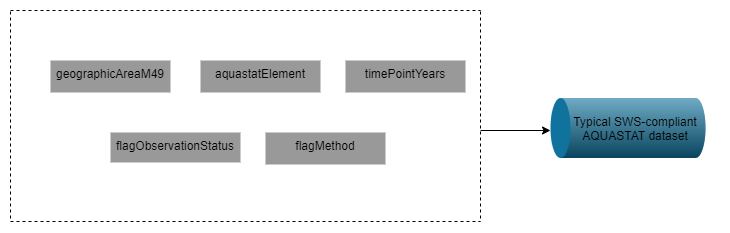

# (APPENDIX) Appendix {-}

# SWS resources

SWS resources are R modules, datatables, data sets, and code lists comprising a migration framework. Data tables are typically used as auxiliary data to help R modules to achieve their goals. The statistical domains in SWS, through code/reference lists, define the dimensions of the datasets. Therefore, datasets are primarily used to store code list - referenced values as either input and output in the SWS. 


<!--```{r fig3, echo=FALSE, fig.cap='Generic data table, dataset, and R module relationship in the SWS context', message=FALSE, warning=FALSE}
require(DiagrammeR)
DiagrammeR::grViz("digraph {
                  
                  graph [layout = dot, rankdir = TB]
                  
                  # define the global styles of the nodes. We can override these in box if we wish
                  node [shape = rectangle, style = filled, fillcolor = Linen]
                  
                  # Inputs
                  SWSdb [label = 'Input \n data living in SWS datatabe', shape = folder, fillcolor = Beige]
                  SWSsharedrive [label = 'Input \n  data living in the SWS share drive', shape = folder, fillcolor = Beige]
                  SWSsession [label = 'Input \n  data living in the session', shape = folder, fillcolor = Beige]

                  SWSdb2 [label = 'Output \n  data saved in SWS datatabe', shape = folder, fillcolor = Beige]
                  SWSsharedrive2 [label = 'Output \n  data saved in the SWS share drive', shape = folder, fillcolor = Beige]
                  SWSsession2 [label = 'Output \n  data saved in the session', shape = folder, fillcolor = Beige]


                  dataset1 [label = 'Input \n long-format four-to-six dimensional dataset', shape = folder, fillcolor = Beige]
                  module [label = 'R module \n data processing and analysis', shape = square, fillcolor = LightBlue]
                  datatable1 [label = 'Data table(s) \n (auxiliary information)', shape = folder, fillcolor = LightGrey]
                  dataset2 [label =  'Output \n long-format four-to-six dimensional dataset', shape = folder, fillcolor = Beige]
                  
                  # Flow
                  # edge definitions with the node IDs
                  {SWSdb, SWSsharedrive, SWSsession} -> dataset1 -> module  
                  {datatable1} -> module
                  dataset2 -> {SWSdb2, SWSsharedrive2, SWSsession2}
                  {module} -> dataset2
                  }")
```-->


## Code lists

Code lists, also called reference lists in SWS parlance, are the dimensions making up the data sets that are designed by the user to store analytical results from SWS modules. The dimensions are statistical-domain-specific and are defined by the technical unit to reflect its needs regarding data collection, processing, and dissemination while meeting FAO standards. Each data set dimension has a set of codes and their associated descriptions. Thus, code lists serve to the purpose of standardization, visualization, and metadata by associating standardized codes to standardized names in the SWS data set outputs. A typical SWS compliant data set has, therefore, the following dimensions/reference lists:


- **Geographic area**. Representing a spatial scale the information is measured at. For example, countries, territories, regional aggregates, regional special groups aggregates, global aggregates. In SWS, the geographic area dimension used by AQUASTAT data sets is named **geographicAreaM49**.

- **Items**. Those one wants to take a measurement from. For example, commodities, commodity groups, land use types, species, etc. Typical item dimension names are **measuredItemCPC**, ***measuredItemHS**, **measuredItem**. The AQUASTAT - SWS framework does not include item code/reference list.

- **Elements**. Often representing a measurement  that can be taken across different items. For example, area, production, share. In SWS, the element dimension/code list used by AQUASTAT is **aquastatElement**. 

<!-- ```{block , type='rmdnote'}

The **aquastatElement** variable in the aquastat_legacy dataset is not SWS compliant. However, the SWS reference list used by the system to map out element codes to definitions is also named **aquastatElement**. It is OK to keep **aquastatElement** as variable name in the legacy data, but the idea is that all datasets produced in the SWS should adhere to SWS standards.

```-->

- **Time** (the time unit the data is displayed for: year, months, etc). In SWS, the time dimension used by AQUASTAT data sets is named **timePointYears**.

- **Flag** (A standardized label indicating origin and/or nature of a number in the data set, e.g. <blank> (Official number)). In SWS, the flag dimension used by AQUASTAT data sets is named **flagObservationStatus**. Please check the [OCS statistical standards](http://intranet.fao.org/statistics_coordination_portal/standards_for_quality_compliance/) and the [flags document](http://intranet.fao.org/fileadmin/user_upload/scp/Standards_for_quality_compliance/SSS_Observation_Status_Codes__Flags__endorsed__December_2016_.pdf ) to understand the flagObservationStatus rational and  obtain the description of flags. 
<br>

<!--```{r  fig4, echo=FALSE, out.width="100%", fig.cap=' Description of flag of observations in the SWS'}
knitr::include_graphics("images/flagobstatus_rev2.png")

```-->

```{r tabFlagObservationStatus, echo=FALSE, message=FALSE}
require(data.table)
require(kableExtra)
d = data.table::fread("tables/flagObservationStatus.csv")
knitr::kable(d, 
             align = 'l',
             # escape = T, 
             # format = "html",
             # table.attr='class="table-fixed-header"',
             caption = "Observation Status Flags Annotations") %>%
  row_spec(0, background = "#b6c5d4") %>% 
  kableExtra::kable_styling(font_size = 14) %>% 
  kable_styling(fixed_thead = T) 
  
```


<br>
- **Method** (A standardized label indicating method utilized to obtain a number in the data set. In SWS, the method dimension used by AQUASTAT data sets is named **flagMethod**. Please check the [OCS statistical standards](http://intranet.fao.org/statistics_coordination_portal/standards_for_quality_compliance/) and the [flags document](http://intranet.fao.org/fileadmin/user_upload/scp/Standards_for_quality_compliance/SSS_Observation_Status_Codes__Flags__endorsed__December_2016_.pdf ) to understand the flagMethod rational and  obtain the description of flags. 

```{r tabFlagMethod, echo=FALSE, message=FALSE}
require(data.table)
require(kableExtra)
d = data.table::fread("tables/flagMethod.csv")
knitr::kable(d, 
             align = 'l',
             # escape = T, 
             # format = "html",
             # table.attr='class="table-fixed-header"',
             caption = "Method flags") %>%
  row_spec(0, background = "#b6c5d4") %>% 
  kableExtra::kable_styling(font_size = 14) %>% 
  kable_styling(fixed_thead = T) 
  
```


<!--``````{r  fig5, echo=FALSE, out.width="100%", fig.cap=' Description of flag of methods in the SWS'}
knitr::include_graphics("images/flagmethod_rev2.png")

```-->

<br>


```{r  fig4, echo=FALSE, out.width="65%", fig.align="center", fig.show='hold', fig.cap='Typical dimensions (SWS code/reference lists) composing a AQUASTAT SWS - compliant input/output dataset'}


```


<!--```{r fig6, echo=FALSE, out.width="100%", fig.cap='Typical dimensions (SWS code/reference lists) composing a AQUASTAT SWS - compliant input/output dataset.', message=FALSE, warning=FALSE}
require(DiagrammeR)
DiagrammeR::grViz("digraph {

graph [layout = dot, rankdir = LR]

# define the global styles of the nodes. We can override these in box if we wish
node [shape = rectangle, style = filled, fillcolor = Linen]

# Inputs
area [label = 'geographicAreaM49', shape = folder, fillcolor = Beige]
element [label = 'measuredElement', shape = folder, fillcolor = Beige]
time [label = 'timePointYears', shape = folder, fillcolor = Beige]
flagObs [label = 'flagObservationStatus', shape = folder, fillcolor = Beige]
flagMeth [label = 'flagMethod', shape = folder, fillcolor = Beige]
aquadataset [label = 'Typical SWS-compliant aquastat dataset', shape = folder, fillcolor = LightBlue]


# Flow
# edge definitions with the node IDs
{area, element, time, flagObs, flagMeth} -> aquadataset 
}")
```-->

<br> 

## Datatables

Datatables are mainly used to store information helping R modules to output analytical results. Information in datatables can be of a number of types. For example, conversion factors, arithmetic formulas, mapping between flags, mapping between international classifications, etc. In SWS hierarchy. all datatables reside in a given statistical domain. 
Variable names (aka column names) in SWS datatables are more flexible in terms of the names they can take than SWS datasets. One can find SWS datatables naming variables as element_code, element_code_sws, element_code_faostat, etc. Likewise, columns describing countries across different datatable may have different classification systems. This flexibility in datatables is beneficial as it allows to accommodate different auxiliary information. 
In the AQUASTAT - SWS migration framework, the data tables are in the **Aquastat domain**. Below is a list of current available and filled data tables in the Aquastat domain.


## AQUASTAT Reference {-}

- **Datatable:** `aquastat_reference`
- **Domain:** AQUASTAT
- **Usage:** This is a reference table listing AQUASTAT element codes, names, dissemination status, variable/indicator status, sources, long-term average variable status and the primary variable rule status.

```{r tab1, echo=FALSE, message=FALSE}
require(data.table)
require(kableExtra)
d = data.table::fread("tables/aquastat_reference_colnames.csv")
knitr::kable(d, 
             align = 'l',
             # escape = T, 
             # format = "html",
             # table.attr='class="table-fixed-header"',
             caption = "Columns description of the datatable: aquastat_reference") %>%
  row_spec(0, background = "#b6c5d4") %>% 
  kableExtra::kable_styling(font_size = 14) %>% 
  kable_styling(fixed_thead = T) 
  
```

## AQUASTAT FAOSTAT Mapping {-}

- **Datatable:** `aquastat_faostat_mapping`
- **Domain:** AQUASTAT
- **Usage:** This datatable maps out AQUASTAT elements to FAOSTAT elements.

```{r tabMappingColumns, echo=FALSE, message=FALSE}
require(data.table)
require(kableExtra)
d = data.table::fread("tables/aquastat_faostat_mapping_colnames.csv")
knitr::kable(d, 
             align = 'l',
             escape = T, 
             # format = "html",
             # table.attr='class="table-fixed-header"',
             caption = "Columns description of the datatable: aquastat_faostat_mapping") %>%
  row_spec(0, background = "#b6c5d4") %>% 
  kableExtra::kable_styling(font_size = 18) %>% 
  kable_styling(fixed_thead = T) 
  
```


## AQUASTAT Sources {-}

- **Datatable:** `aquastat_sources`
- **Domain:** AQUASTAT
- **Usage:** This datatable stores AQUASTAT data source references.


```{r tab_source_names, echo=FALSE, message=FALSE}
require(data.table)
require(kableExtra)
d = data.table::fread("tables/aquastat_sources_colnames.csv")
knitr::kable(d, 
             align = 'l',
             escape = T, 
             # format = "html",
             # table.attr='class="table-fixed-header"',
             caption = "Columns description of the datatable: aquastat_sources") %>%
  row_spec(0, background = "#b6c5d4") %>% 
  kableExtra::kable_styling(font_size = 18) 
  
```


## Calculation Rule {-}

- **Datatable:** `calculation_rule`
- **Domain:** AQUASTAT
- **Usage:** This datatable stores the pre-defined calculation rules used to obtain AQUASTAT indicators/derived variables. This table is used by the **faoswsAquastatUpdate** module.


```{r tab4, echo=FALSE, message=FALSE}
require(data.table)
require(kableExtra)
d = data.table::fread("tables/calculation_rule_colnames.csv")
knitr::kable(d, 
             # align = 'l',
             # escape = T, 
             # format = "html",
             # table.attr='class="table-fixed-header"',
             caption = "Columns description of the datatable: calculation_rule") %>%
  row_spec(0, background = "#b6c5d4")  
  
```


## Global Dam Reservoir {-}

- **Datatable:** `global_dam_reservoir`
- **Domain:** AQUASTAT
- **Usage:** A datatable storing national expert - provided information on the major Dams at the country level and used to calculate Dam capacity time-series.


```{r tab5, echo=FALSE, message=FALSE}
require(data.table)
require(kableExtra)
d = data.table::fread("tables/global_dam_reservoir_colnames.csv")
knitr::kable(d, 
             # align = 'l',
             # escape = T, 
             # format = "html",
             # table.attr='class="table-fixed-header"',
             caption = "Columns description of the datatable: global_dam_reservoir") %>%
  row_spec(0, background = "#b6c5d4")  
  
```

## Global Map of Irrigated Area {-}

- **Datatable:** `Global Map of Irrigated Area`
- **Domain:** AQUASTAT
- **Usage:** A datatable storing information for the update of spatial representation of irrigated areas at the national level.


```{r tab6, echo=FALSE, message=FALSE}
require(data.table)
require(kableExtra)
d = data.table::fread("tables/global_map_irrigated_area_colnames.csv")
knitr::kable(d, 
             # align = 'l',
             # escape = T, 
             # format = "html",
             # table.attr='class="table-fixed-header"',
             caption = "Columns description of the datatable: Global Map of Irrigated Area") %>%
  row_spec(0, background = "#b6c5d4")  
  
```


## AQUASTAT SDG Aggregates {-}

- **Datatable:** `aqua_sdg_agg`
- **Domain:** AQUASTAT
- **Usage:** A datatable storing the calculation rules to apply to aggregation of the SDG 6.4.2 (Water Stress) at the regional level and used by the **faoswsAquastatAggregation**.


```{r tab7, echo=FALSE, message=FALSE}
require(data.table)
require(kableExtra)
d = data.table::fread("tables/aqua_sdg_agg_colnames.csv")
knitr::kable(d, 
             # align = 'l',
             # escape = T, 
             # format = "html",
             # table.attr='class="table-fixed-header"',
             caption = "Columns description of the datatable: aqua_sdg_agg") %>%
  row_spec(0, background = "#b6c5d4")  
  
```

## AQUASTAT External sources {-}

- **Datatable:** `aqua_external_source`
- **Domain:** AQUASTAT
- **Usage:** A data table with the mapping between AQUASTAT and data used by AQUASTAT from external agencies and used by the **faoswsAquastatExternal** module.


```{r tab8, echo=FALSE, message=FALSE}
require(data.table)
require(kableExtra)
d = data.table::fread("tables/aqua_external_source_colnames.csv")
knitr::kable(d, 
             # align = 'l',
             # escape = T, 
             # format = "html",
             # table.attr='class="table-fixed-header"',
             caption = "Columns description of the datatable: aqua_external_source") %>%
  row_spec(0, background = "#b6c5d4")  
  
```

## M49 FS ISO Mapping {-}

- **Datatable:** `m49_fs_iso_mapping`
- **Domain:** Common Domain
- **Usage:** A datatable with the correspondence between FAOSTAT, UNSDM49, ISO3, and ISO3 codes. This table is used by the **faoswsAquastatExternal** module.


```{r tab9, echo=FALSE, message=FALSE}
require(data.table)
require(kableExtra)
d = data.table::fread("tables/m49_fs_iso_mapping_colnames.csv")
knitr::kable(d, 
             # align = 'l',
             # escape = T, 
             # format = "html",
             # table.attr='class="table-fixed-header"',
             caption = "Columns description of the datatable: m49_fs_iso_mapping") %>%
  row_spec(0, background = "#b6c5d4")  
  
```


```{block , type='rmdnote'}

```

<br>

## Datasets

Datasets in the SWS are interchangeably used as module inputs/outputs and are composed by dimensions (aka reference/code lists). Because SWS datasets contain code lists following international standards as dimensions, there is little space for variation of dimension names across SWS datasets for the sake of standardization. In the AQUASTAT - SWS framework, the available data sets are:

1. **aquastat_legacy**. The **aquastat_legacy** is an SWS dataset with the legacy data from the 'Old' AQUASTAT working system. The CIO - SWS has migrated the aquastat_legacy dataset into the SWS in order to store the whole data coming from the old system. The **aquastat_legacy** dataset is the bare minimum of AQUASTAT, meaning that none analytical process has been applied to it, including the calculation of AQUASTAT indicators (aka derived variables). 

2. **aquastat_questionnaire**. An SWS dataset output from the questionnaire harvester produced by module `faoswsAquastatQeustionnaire`. This dataset feeds, along with the aquastat_external and the aquastat_update datasets, the `faoswsAquastatUpdate` module. More information is found in the chapter \@ref(AquastatQuestionnaire).

3. **aquastat_external**. An SWS dataset output from the **faoswsAquastatExternal** module which replaces the lack of a proper CIO-developed harvester for external source data used by AQUASTAT. More information is found in the chapter \@ref(AquastatExternal).


4. **aquastat_update**. This dataset is the most complete dataset, storing the AQUASTAT compiled data. For more details, please see chapter \@ref(faoswsAquastatUpdate).

